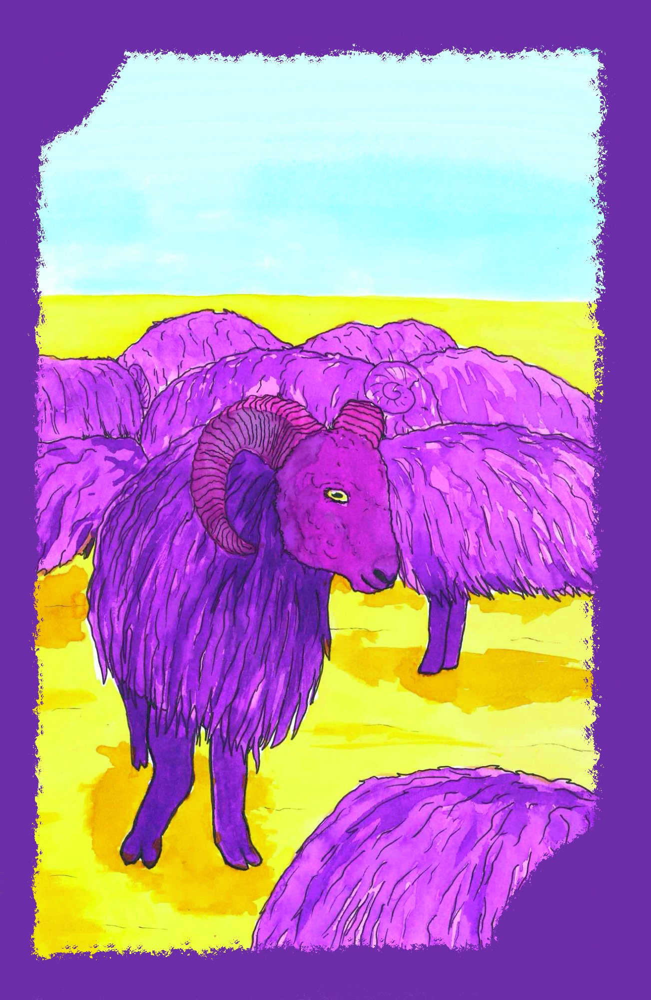
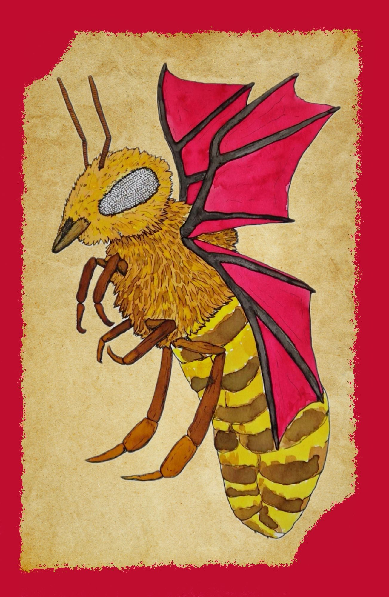
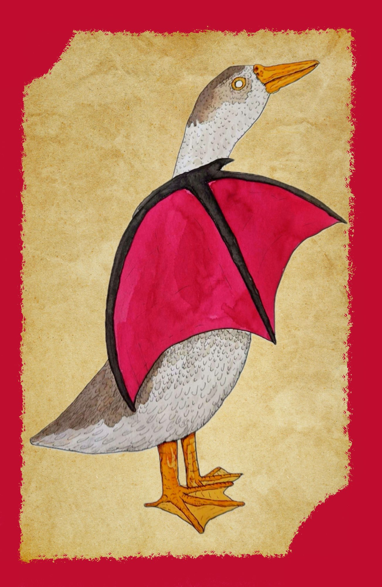
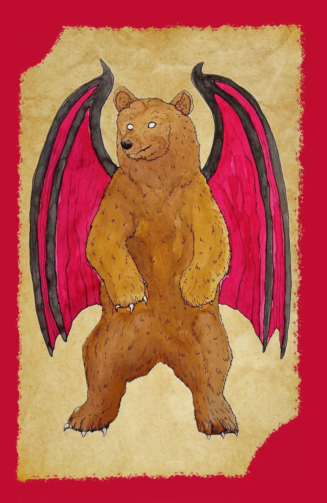
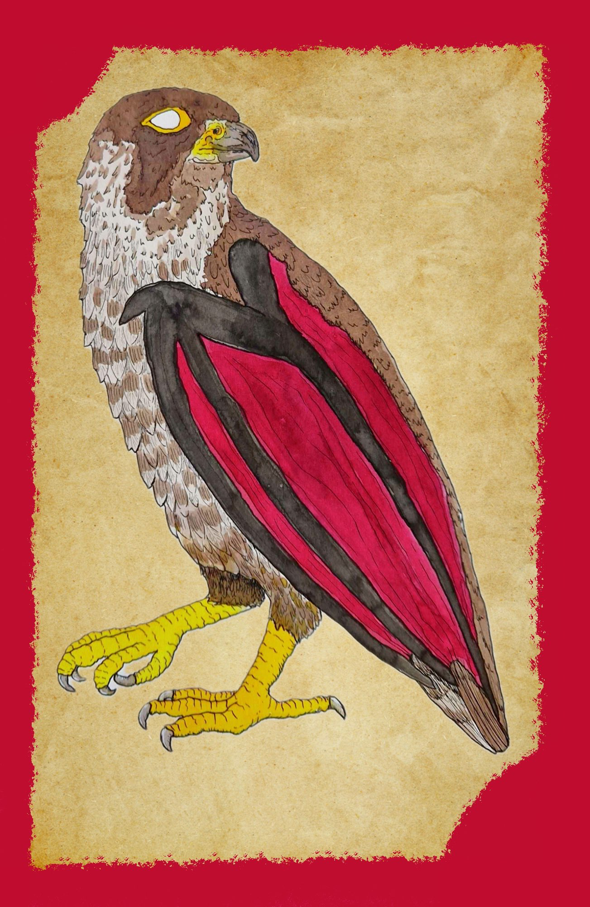
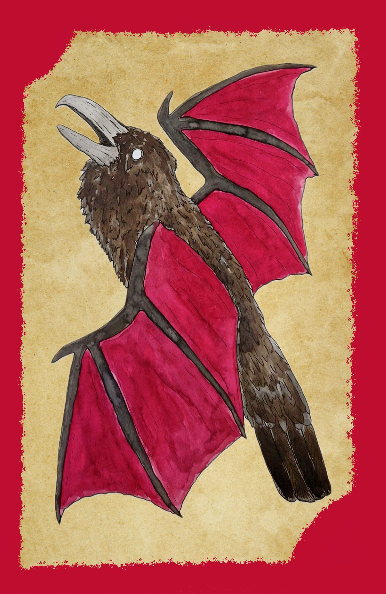
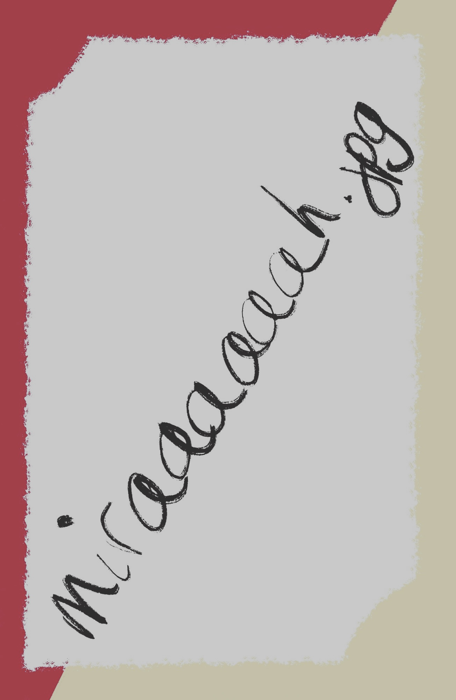
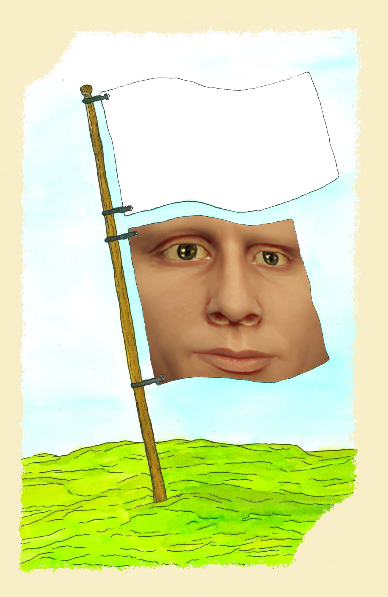

# 🏴‍☠️ Règles du jeu Skull King

Guide complet des règles officielles de Skull King avec exemples détaillés.

## 🎯 Objectif du jeu

Marquer le plus de points en prédisant exactement le nombre de plis que vous allez remporter à chaque manche. La précision est récompensée, l'erreur est punie !

---

## 🃏 Composition du jeu (70 cartes)

### Cartes numériques (56 cartes)
- **1 à 14** dans **4 couleurs** : Noir, Vert, Violet, Jaune
- Les cartes noires ont une valeur spéciale (voir hiérarchie)

**Exemples de cartes numériques par couleur :**

   

*De gauche à droite : Noir, Vert, Violet, Jaune*

### Cartes spéciales (14 cartes)
- 👑 **Skull King** (1 carte) - La carte la plus puissante
- 🏴‍☠️ **Pirates** (5 cartes) - Battent toutes les cartes colorées et les sirènes
- 🧜‍♀️ **Sirènes** (2 cartes) - Capturent le Skull King et battent les cartes colorées
- 🐯 **Tigresse** (1 carte) - Agis comme une fuite ou comme un pirate, au choix
- 🏃‍♂️ **Fuites** (5 cartes) - Ne peuvent remporter aucun pli

**Visuels des cartes spéciales :**

**Skull King :**

**Pirates (5 cartes différentes) :**

    

**Sirènes (2 cartes différentes) :**

 

**Tigresse (polyvalente) :**

 

*La Tigresse peut être jouée soit comme un pirate, soit comme une fuite*

 

**Fuites (5 cartes) :**

*Les 5 cartes de fuite ont le même visuel*

---

## 🔹 Hiérarchie des cartes

### Ordre de force (du plus fort au plus faible)

1. **🧜‍♀️ Sirènes** > Skull King, tout le reste
2. **👑 Skull King** > Pirates, tout le reste
3. **🏴‍☠️ Pirates / 🐯 Tigresse-Pirate** > Sirènes, tout le reste
4. **Cartes numériques** : 14 > 13 > ... > 1, Noir > autres couleurs
5. **🏃‍♂️ Fuites / 🐯 Tigresse-Fuite** : ne gagnent jamais

### Règles spéciales des cartes numériques

- **Obligation de suivre** : Si vous avez la couleur demandée, vous devez la jouer
- **Cartes noires** : Le noir bat les autres couleurs
- **Hors couleur** : Si vous ne pouvez pas suivre à la couleur, vous ne pouvez pas gagner le pli (sauf avec une carte spéciale)
- **Premier joué** : En cas d'égalité de type sur les cartes spéciales, la première carte jouée l'emporte sur les autres

### Règles des cartes spéciales

#### 🐯 Tigresse
- **Au moment de jouer** : Vous devez choisir si elle agit comme :
  - **Pirate** : Peut gagner contre les cartes numériques
  - **Fuite** : Ne peut jamais gagner un pli
- Une fois jouée, elle reste dans ce rôle pour tout le pli
---

## 🎮 Déroulement du jeu

### Mise en place
1. **2 à 8 joueurs** peuvent participer
2. Le jeu se déroule en **10 manches**
3. À la manche N, chaque joueur reçoit **N cartes**

### Phase 1 : Distribution
- Manche 1 : 1 carte par joueur
- Manche 2 : 2 cartes par joueur
- ...
- Manche 10 : 10 cartes par joueur

### Phase 2 : Enchères
Chaque joueur fait son **pari** :
- **Nombre de plis** qu'il pense remporter (0 à N)
- **Pari simultané**

### Phase 3 : Jeu des cartes
- Le **premier joueur** entame avec n'importe quelle carte
- Les autres joueurs **suivent dans l'ordre**
- **Obligation de suivre la couleur** si possible
- Le **gagnant du pli** entame le pli suivant

### Phase 4 : Décompte
Calcul des scores selon les règles de points (voir section suivante).

---

## 🏆 Système de points

### Points de base

#### Pari réussi (exact)
- **20 points par pli** remporté

**Exemple** : Pari de 3 plis réussi = (3×20) = **60 points**

#### Pari raté
- **-10 points par pli de différence**

**Exemples** :
- Pari 3, réalisé 1 : -10 × |3-1| = **-20 points**
- Pari 2, réalisé 5 : -10 × |2-5| = **-30 points**

#### Pari zéro
- **Réussi** : 10 points × numéro de la manche
- **Raté** : -10 points par pli remporté

**Exemples** :
- Manche 5, pari 0 réussi : 10×5 = **50 points**
- Manche 3, pari 0 mais 2 plis : -10×2 = **-20 points**

---

## 🎁 Points bonus

> ⚠️ **Important** : Les points bonus ne sont accordés que si vous réussissez **exactement** votre pari !

### Bonus pour les cartes 14

**Cartes 14 dans les plis :**
- **14 de couleur** (Vert, Violet, Jaune) : **+10 points** par carte
- **14 noir** (Drapeau pirate) : **+20 points**

*Exemples de cartes 14 qui donnent des bonus :*

   &nbsp;&nbsp;&nbsp;&nbsp;&nbsp;&nbsp; 

*(+10 pts chacune)* &nbsp;&nbsp;&nbsp;&nbsp;&nbsp;&nbsp;&nbsp;&nbsp;&nbsp;&nbsp;&nbsp;&nbsp;&nbsp;&nbsp;&nbsp;&nbsp;&nbsp;&nbsp; *(+20 pts)*

### Bonus pour les captures de cartes spéciales

**Captures réalisées dans vos plis gagnés :**
- **🧜‍♀️ Sirène capturée par un Pirate** : **+20 points** par sirène
- **🏴‍☠️ Pirate capturé par Skull King** : **+30 points** par pirate
- **👑 Skull King capturé par une Sirène** : **+40 points**

**Exemples de captures qui donnent des bonus :**

 capture  = **+20 points**

 capture  = **+30 points**

 capture  = **+40 points**

### Règles des captures

1. **L'ordre de jeu ne compte pas** : L’ordre dans lequel les cartes sont jouées ne change rien à l’attribution de ces points bonus.
2. **Le gagnant du pli** reçoit les points de capture
3. **Tigresse** : Compte comme pirate ou fuite selon le choix fait

---

## 🎲 Stratégies et conseils

### Stratégie de base
1. **Analysez votre main** : Comptez vos cartes fortes et faibles
2. **Anticipez les autres** : Essayez de deviner leurs paris
3. **Gérez la Tigresse** : Utilisez-la au bon moment
4. **Jouez les bonus** : Les 14 et captures peuvent faire la différence

### Gestion des cartes spéciales
- **Skull King** : Gardez-le pour un pli important, attention aux sirènes
- **Pirates** : Excellents pour "voler" des plis, mais vulnérables au Skull King
- **Sirènes** : Parfaites contre Skull King et pirates
- **Tigresse** : Très flexible, adaptez selon la situation
- **Fuites** : Idéales pour les paris zéro ou pour "passer" un pli

### Paris optimaux
- **Pari zéro** : Très rentable si vous avez beaucoup de fuites
- **Pari modéré** : Plus sûr, surtout avec des cartes moyennes
- **Pari ambitieux** : Risqué mais très rentable avec de bonnes cartes

---

## 🏁 Fin de partie

### Condition de victoire
Après **10 manches**, le joueur avec le **score total le plus élevé** gagne.

### Égalités
En cas d'égalité, les joueurs partagent la victoire.

### Scores typiques
- **Débutant** : 100-200 points
- **Expérimenté** : 200-400 points
- **Expert** : 400+ points

---

## 🔄 Variantes optionnelles

Aucune variante n'a encore été ajoutée à cette section. Revenez plus tard pour découvrir des variantes de jeu !
<!-- ### Variante rapide
- Jouer seulement **5 manches** (1 à 5 cartes)
- Idéal pour une partie plus courte

### Variante progressive
- Commencer par **0 carte** (pas de pli, que des paris)
- Ajoute une manche supplémentaire

### Variante équipes
- Jouer en **équipes de 2**
- Les scores sont additionnés par équipe -->

---

## 📚 Règles officielles

Pour les règles officielles complètes et les cas particuliers, consultez :
- [Règles officielles PDF](https://www.play-in.com/pdf/rules_games/skull_king_regles_fr.pdf)
- [BoardGameGeek - Skull King](https://boardgamegeek.com/boardgame/150145/skull-king)

---

*Bonne chance et que le meilleur pirate gagne ! 🏴‍☠️*
